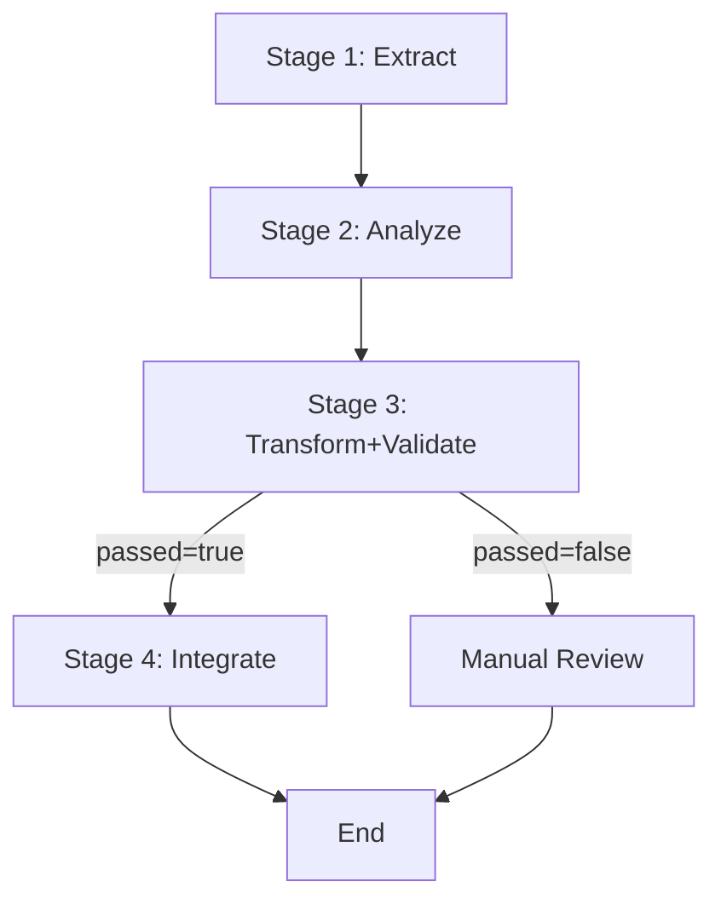

Developer: # Figma to Code Workflow

> **목적**: Figma 디자인을 프로젝트별 디자인 시스템에 맞는 코드로 자동 변환
> **역할**: Control Tower (Orchestrator) - 단계별 라우팅만 담당

---

## 사전 안내: 디자인 시스템 명세 전달 필수
**워크플로우를 시작하기 전에 반드시 프로젝트에 맞는 design system 파일을 전달·지정해야 진행이 가능합니다.**
- `.claude/config/design-system.md` (또는 프로젝트별 지정 경로)
- 만약 경로를 찾거나 파일을 받을 수 없다면 _반드시 사용자의 design system 문서를 요청_ 하세요.

---

## Pipeline Overview

```
Extract → Analyze → Transform+Validate → Integrate
```

**3~7개 개념적 체크리스트로, 구체 구현이 아닌 흐름만 요약하세요.**
1. Figma 노드 데이터 및 에셋 추출
2. 추출 데이터 분석 후 컴포넌트 명세 생성
3. 코드 변환 후 디자인 시스템 기준으로 검증
4. 생성된 코드 프로젝트에 통합
5. 최종 산출물 및 중간 결과물 저장

---

## STAGE 1: 추출(Extract)

**Agent**: `figma-extractor`

### Input
```yaml
nodeId: string                    # Figma 노드 ID (예: "123:456")
prd: string                       # 기능 요구사항 문서 (필수)
featureName: string               # 기능명 (파일 경로용, 예: "checkout-flow")
maxDepth: number = 3              # 재귀 깊이 제한
```

### Process
1. `get_metadata(nodeId)` 호출로 노드 구조 파악
2. 추출 전략 결정:
   - **단순**: 깊이 < 2 AND 노드 < 10
     - `get_code(nodeId)` 한 번 호출
     - 단일 컴포넌트 반환
   - **복잡**: 깊이 >= 2 OR 노드 >= 10
     - 리프 노드별로 `get_code()` 개별 호출
     - 컴포넌트 트리 구성
3. `get_screenshot(nodeId)` 호출

**각 도구 호출/코드 편집 후 1~2줄로 결과 검증 → 실패시 스스로 재시도**

### Output
```typescript
figmaBundle: {
  metadata: FigmaMetadata          // 노드 구조 정보
  code: string | ComponentTree     // 단일 코드 혹은 컴포넌트 트리
  screenshot: string               // base64 이미지
  variables: VariableDefinitions   // Figma 변수
  error?: ExtractStageError        // 실패 시 에러 정보(선택)
}
```
- FigmaMetadata, ComponentTree, VariableDefinitions, ExtractStageError 정의는 [Output Format] 참고.
- code는 단순이면 string, 복잡이면 ComponentTree 객체.
- error 필드는 추출 실패 또는 부분 실패시 사용, 없으면 단계 성공으로 간주.

### Artifacts
```
.figma-cache/{featureName}/
├── extraction.json    # figmaBundle 전체 저장 (디버깅/캐싱용)
└── screenshot.png     # 스크린샷 이미지
```

### Route To
**Stage 2**

---

## STAGE 2: 분석 및 명세화(Analyze & Spec)

**Agent**: `spec-generator`

### Input
```yaml
figmaBundle: object              # Stage 1 output
prd: string                      # Stage 1에서 전달받은 PRD
```

### Process
1. Figma metadata + PRD 분석
2. 컴포넌트 명세 생성:
   - 컴포넌트 목적 및 책임
   - Props 인터페이스 정의
   - 상태 관리 요구사항
   - 통합 포인트 식별

### Output
```typescript
componentSpec: {
  purpose: string                     // 컴포넌트 목적
  components: ComponentSpec[]         // 생성할 컴포넌트 목록
  propsInterface: TypeDefinition      // Props 타입 정의
  stateRequirements: StateSpec        // 상태 관리 요구사항
  integrationPoints: IntegrationSpec  // 통합 포인트
  error?: SpecStageError              // 실패 시 에러 정보(선택)
}
```
- 각 타입 정의는 [Output Format]에 명시.
- error 필드는 스펙 추출 실패/부분 오류 시 사용, 없으면 성공.

### Artifacts
```
.figma-cache/{featureName}/
└── spec.md            # 컴포넌트 명세 문서
```

### Route To
**Stage 3**

---

## STAGE 3: 변환 및 검증(Transform with Validation)

**Agent**: `code-transformer`

### Input
```yaml
figmaBundle: object              # Stage 1 output
componentSpec: object            # Stage 2 output
designSystem: @.claude/config/design-system.md (또는 프로젝트 경로)
```

### Process

#### 3.1 변환(Transform)
1. Figma 코드를 '지정된' design system 기준에 맞게 변환 (design-system 파일 명시적 지정 필요)

#### 3.2 검증(Validate)
2. 변환된 코드 검증:
   - Figma 스크린샷과 비교
   - componentSpec 준수 여부 확인
   - 디자인 시스템 규칙 검사

#### 3.3 자동수정(Auto-fix)
3. 위반사항 자동수정 (최대 3회 반복):
   - 색상 토큰 미사용 → 자동 변환
   - 레이아웃 컴포넌트 미사용 → 자동 변환
   - 타입 불일치 → 자동 수정

**코드 편집 시: (1) 가정 명시, (2) 최소 테스트 작성·실행, (3) 검토가능한 diff 출력, (4) 레포 스타일 준수.**

### Output
```typescript
generatedCode: {
  components: Array<{
    path: string        // 예: "libs/ui/ops-admin/screen/checkout/CheckoutForm.tsx"
    code: string        // 컴포넌트 코드
    tests?: string      // 테스트 코드 (있으면 포함)
  }>
  validationReport: {
    passed: boolean
    violations: Violation[]   // 위반 사항
    autoFixed: Fix[]          // 자동수정 내역
    manualReviewNeeded: Issue[] // 수동 검토 필요 사항
    error?: TransformStageError // 실패/예외 정보(선택)
  }
}
```
- 'tests' 필드는 생성된 경우만 포함; 없으면 생략
- 각 타입 구조는 [Output Format] 참고
- error 필드는 단계 실패/예외 발생시 포함

### Artifacts
```
.figma-cache/{featureName}/
├── generated/                    # 생성된 코드 (최종 버전)
│   ├── Component1.tsx
│   └── Component2.tsx
└── validation-report.json        # 검증 리포트
```

### Route To
- **If** `validationReport.passed === true`: **Stage 4**
- **Else**: **Manual Review** (워크플로우 종료, 수동 검토 필요 정보 포함)

---

## STAGE 4: 통합(Integration)

**Agent**: `file-integrator`

### Input
```yaml
generatedCode: object            # Stage 3 output
```

### Process
1. 파일 충돌 검사 (동일 경로에 파일 존재 시 사용자 확인 요청 필수)
2. 실제 경로에 파일 생성
3. 타입 체크 실행: `pnpm affected:compile`
4. Storybook 파일 생성 (조건부)
   - 컴포넌트 복잡도 > threshold 시 자동 생성

**각 단계별 1~3문장 미니 리포트 제공: 결과, 다음 진행, 장애(있다면).**

### Output
```typescript
integrationResult: {
  filesCreated: string[]          // 생성된 파일 경로 목록 (정렬 순서: 생성 순)
  typeCheckPassed: boolean        // 타입 체크 결과
  storybookGenerated?: boolean    // Storybook 생성 여부 (true/생략/null)
  conflicts: ConflictInfo[]       // 파일 충돌 정보, 없으면 빈 배열
  error?: IntegrationStageError   // 실패/예외 정보(선택)
}
```
- filesCreated 배열은 실제 생성 순서로 반환
- storybookGenerated는 생성 시 true, 미생성이면 undefined 또는 누락
- conflicts는 경로 충돌 시 정보, 없으면 빈 배열
- error 필드는 통합 과정의 예외·실패 상황에서 사용

### Artifacts
```
libs/ui/{admin}/screen/{domain}/
├── Component.tsx                 # 실제 프로젝트 파일
└── Component.stories.tsx         # Storybook (선택적)
```

### Route To
**End** (워크플로우 완료)

---

## Configuration Dependencies

### 디자인 시스템 매핑
**경로**: `.claude/config/design-system.md` (또는 프로젝트 지정)

**필수 섹션:**
- Color mapping 규칙
- Layout component 매핑
- Typography 매핑
- 파일 경로 전략 등

---

## Routing Logic



---

## 실행 제약사항(Execution Constraints)

### 필수 입력값(Required Inputs)
- `nodeId`: Figma 노드 ID (필수)
- `prd`: 기능 요구사항 문서 (필수)
- `featureName`: 기능명 (필수)
- **designSystem 파일 경로**: 워크플로우 시작 전에 반드시 지정 필요 (없을시 사용자에 요청)

### 분기 경로(Conditional Routes)
- **Stage 3 → Stage 4**: `validationReport.passed === true`
- **Stage 3 → Manual Review**: `validationReport.passed === false`

### 상태 관리
- **Primary**: 메모리 기반 객체 전달
- **Secondary**: `.figma-cache/` 디렉토리에 캐싱 (디버깅/재실행용)

---

## 사용 예시(Usage Example)

```bash
# 명령 실행 예시
/figma-to-code nodeId="123:456" featureName="checkout-flow" prd="@docs/prd/checkout.md" designSystem="@.claude/config/design-system.md"

# 워크플로우 실행 예시
디자인 시스템 지정 확인... (성공)
Stage 1: Figma 노드 123:456 추출 중...
  ✓ Metadata 추출됨
  ✓ 코드 추출 완료 (복잡 모드: 3 컴포넌트)
  ✓ 스크린샷 저장

Stage 2: 컴포넌트 분석...
  ✓ CheckoutForm, PaymentMethod, OrderSummary 명세 생성

Stage 3: 코드 변환/검증...
  ✓ DamoaColor 매핑 적용 (15건)
  ✓ VStack/HStack 변환 (8건)
  ✓ 검증 통과

Stage 4: 프로젝트 통합...
  ✓ libs/ui/ops-admin/screen/checkout/CheckoutForm.tsx 생성
  ✓ libs/ui/ops-admin/screen/checkout/PaymentMethod.tsx 생성
  ✓ libs/ui/ops-admin/screen/checkout/OrderSummary.tsx 생성
  ✓ 타입 체크 통과
  ✓ Storybook 생성됨

✅ 워크플로우가 성공적으로 완료되었습니다.
```

---

## 참고(Notes)

- **하드코딩 불가**: 모든 프로젝트별 디자인 시스템 규칙은 config 파일에서 주입
- **중간 산출물 최소화**: 최종 결과물만 프로젝트에 저장, 작업 중간 캐시/디버깅 파일은 별도 경로 보관
- **메모리 중심**: 단계간 데이터는 객체로 전달, 파일 저장은 보조 수단
- **단일 책임 원칙**: 각 단계는 오로지 한 가지 역할만 수행

---

## Output Format (출력 형식)

### 공통 가이드라인
- 모든 output object에서 에러/예외 발생시 `error` 필드 포함 (객체, 없으면 undefined/생략)
- 명시된 배열 필드는 항상 정의(값 없음 = 빈 배열 반환)
- 명시적 선택 필드는 조건 충족시만 포함, 아니면 생략/undefined
- null/undefined는 예외적 상황에서만(불가피/실패) 허용
- 모든 경로·파일명은 unix-style 구분자 사용
- 중첩 타입은 단계별로 별도 정의(아래 참고)

### 타입 정의 예시는 [기존 Output Format 영역] 참고